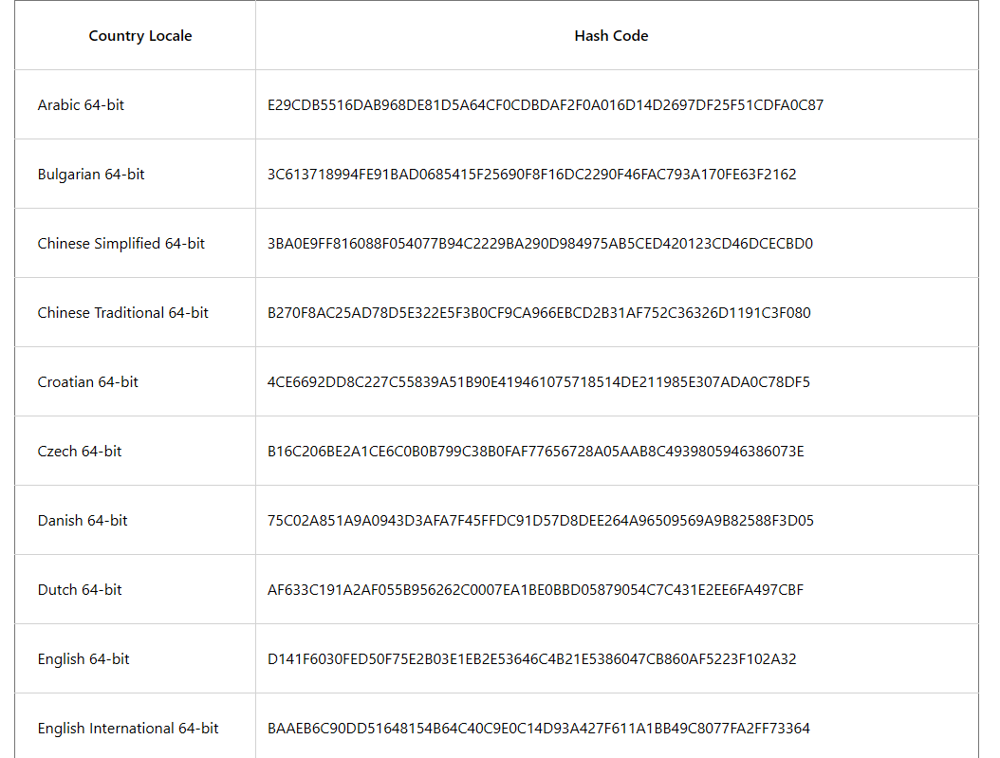
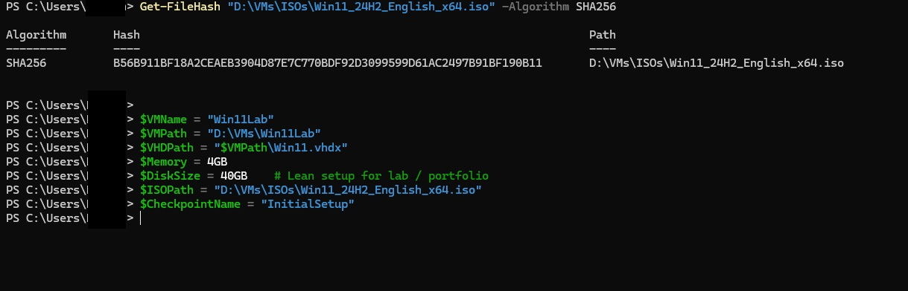

# Creating a Windows 11 Lab VM with Hyper-V Using PowerShell

This guide provides a step-by-step process for setting up a Windows 11 virtual machine (VM) in Hyper-V using PowerShell.  
It emphasizes creating and configuring virtual network switches — a critical step to ensure network connectivity and avoid setup issues.  
The steps are derived from verified PowerShell sessions and ordered for reproducibility.

---

##  Prerequisites

### 1. Hyper-V Enabled
Ensure Hyper-V is installed and enabled on your Windows host (**Windows 10/11 Pro or higher**).

Enable via **Optional Features** in Settings or run the following in PowerShell (as Administrator):

```powershell
Enable-WindowsOptionalFeature -Online -FeatureName Microsoft-Hyper-V -All
```


### 2. PowerShell Version
Use **PowerShell 7+** (e.g., `7.5.3`).  
Launch with:

```powershell
pwsh
```

if installed alongside Windows PowerShell.

### 3. ISO File
Download the Windows 11 ISO (e.g., `Win11_24H2_English_x64.iso`) from Microsoft’s official site.  
Verify the download hash:

```powershell
$isoPath = "D:\VMs\ISOs\Win11_24H2_English_x64.iso"
Get-FileHash $isoPath -Algorithm SHA256 | Format-List
```

Example output (Get-FileHash) — verify the SHA256 matches the official value:

```powershell
Algorithm : SHA256
Hash      : <SHA256_HASH_HERE>
Path      : D:\VMs\ISOs\Win11_24H2_English_x64.iso
```


*Example cropped Get-FileHash output showing the SHA256 and file path.*

Compare the result to the official SHA256 hash below for Build **26100.1742**:

| Country Locale | Hash Code |
|-----------------|------------|
| Arabic 64-bit | E29CDB5516DA9696DE81D5A64C0CDBDAF2F0A016D14142697DF2F5F1CDFA0C87 |
| Bulgarian 64-bit | 3C613718994FE91BAD0685415F25690F8F16DC29046FAFC793A170F6E32162162 |
| Chinese Simplified 64-bit | 3BA0EF816088F0540774C22B82909D8475AB5CED42123D46CECBD0 |
| Chinese Traditional 64-bit | B270F8AC25D78E0F25F3B0C9CA96EBCB831AF752C363D6191C0D |
| Croatian 64-bit | 4CE6B2D8C227C55839A1B90494610778514DE2198E307ADA0C8DF5 |
| Czech 64-bit | B1C206BE24C5C080B79C38B0AF776572A5A5ABC4998059468073E |
| Danish 64-bit | 75C2A51A9A943D3AF74FFDC1957DE2E64965969A98258F3D05 |
| Dutch 64-bit | AF63391A2AF0559562C00E7A1E0BBD587904C4C31EE6F49CBF |
| English 64-bit | D141F630F5D07F7E2B03E1EBE25646C82153860C7B860A5F23102A3 |
| English International 64-bit | BAAEB690D564815B64C40C9E14D3A4276118B49C807FAFF7364 |


Visual reference (official hashes):


*Full hash table (visual) for the Windows 11 ISO across country locales.*

>  If your hash differs, it may be from an older ISO. Redownload and reverify.

### 4. Storage
Allocate **60GB+** free space for the VHDX in a directory like `D:\VMs`.

### 5. Administrative Privileges
Run all commands in an **elevated PowerShell session**.

### 6. Network Adapter
Ensure an active physical network adapter (e.g., **Ethernet**) for external switches.

---

##  Important Notes

- **Network Switches:** Hyper-V VMs require virtual switches for networking.
  - *Default Switch*: NAT-based internet access.
  - *External*: Direct host/internet access.
  - *Private*: VM-to-VM isolation.
  - *Internal*: Host ↔ VM only.
- **Generation 2 VMs:** This guide uses **Gen 2** for modern features like Secure Boot (disabled here for simplicity).
- **Checkpoints:** Use checkpoints (snapshots) as restore points, especially before network changes.
- **Verification:** After major steps, check VM state with:
  ```powershell
  Get-VM -Name <VMName>
  ```
- **Troubleshooting:**  
  - Load Hyper-V module if needed:  
    ```powershell
    Import-Module Hyper-V
    ```
  - For network issues:  
    ```powershell
    Get-NetAdapter
    ```

---

##  Step-by-Step Setup

### Step 1: Verify Hyper-V Module and Network Adapters
Confirm the Hyper-V module and list active network adapters for external switches.

```powershell
# Check Hyper-V module
Get-Module Hyper-V -ListAvailable

# List active network adapters (identify your physical Ethernet/Wi-Fi adapter)
Get-NetAdapter | Where-Object { $_.Status -eq "Up" }
```

Example output (Get-NetAdapter) — confirm which physical adapter to use for external switches:

```powershell
Name      : Ethernet
Status    : Up
MacAddress: 00:11:22:33:44:55
```


*Example PowerShell session showing Get-Command/Get-Module for New-VMSwitch and active adapters (Get-NetAdapter).* 


---

### Step 2: Create Virtual Network Switches
Create switches **before** the VM to ensure network options — this is critical for connectivity.

#### 2.1 Create an External Switch (for Internet/Host Sharing)

```powershell
$switchName = "TechLabNet"
if (-not (Get-VMSwitch -Name $switchName -ErrorAction SilentlyContinue)) {
    New-VMSwitch -Name $switchName -NetAdapterName "Ethernet" -AllowManagementOS $true
}
# Verify
Get-VMSwitch -Name $switchName
```

After creating the external switch, verify with Get-VMSwitch and check the GUI:

```powershell
Get-VMSwitch -Name $switchName
# Example: Name: TechLabNet  SwitchType: External  NetAdapterInterfaceDescription: Ethernet
```


*Virtual switch created and enabled in Hyper-V Manager.*


---

### Step 3: Define VM Configuration Variables
Set reusable VM specs.

```powershell
$VMName = "Win11Lab"
$VMPath = "D:\VMs\Win11Lab"
$VHDPath = "$VMPath\$VMName.vhdx"
$Memory = 4GB
$DiskSize = 60GB
$ISOPath = "D:\VMs\ISOs\Win11_24H2_English_x64.iso"
```

> Customize values as needed — 4GB RAM minimum for Windows 11.

Example variable assignments (used throughout the script):



*PowerShell output showing Get-FileHash full output followed by variable assignments for VMName, VHDPath, Memory, DiskSize and ISOPath.*

---

### Step 4: Create the VM

```powershell
New-VM -Name $VMName -MemoryStartupBytes $Memory -Generation 2 `
       -NewVHDPath $VHDPath -NewVHDSizeBytes $DiskSize -Path $VMPath

# Verify VM creation
Get-VM -Name $VMName | Format-Table Name, State, CPUUsage, MemoryAssigned, Uptime, Status, Version
```


Example verification (Get-VM) after creation — the VM should be present (Off until started):

```powershell
Name      State  CPUUsage MemoryAssigned Uptime
----      -----  -------- ------------  ------
Win11Lab  Off    0        0              00:00:00
```
Example Output:

| Name | State | CPUUsage(%) | MemoryAssigned(M) | Uptime | Status | Version |
|------|--------|-------------|-------------------|---------|---------|----------|
| Win11Lab | Off | 0 | 0 | 00:00:00 | Operating normally | 11.0 |

---


*Full PowerShell session: variable setup, New-VM, verification, DVD attach, network attach, checkpoint, Start-VM and vmconnect (captures the creation through boot/console).* 

### Step 5: Attach Installation Media (ISO)
Mount the verified Windows ISO for installation.

```powershell
Set-VMDvdDrive -VMName $VMName -Path $ISOPath

# Verify DVD drive
Get-VMDvdDrive -VMName $VMName
```

Example Output:

| VMName | ControllerType | ControllerNumber | ControllerLocation | DvdMediaType | Path |
|---------|----------------|------------------|--------------------|---------------|------|
| Win11Lab | SCSI | 0 | 1 | ISO | D:\VMs\ISOs\Win11_24H2_English_x64.iso |

---

### Step 6: Configure Initial Network Adapter
Attach the VM to a switch for basic connectivity.

```powershell
$switch = Get-VMSwitch | Where-Object { $_.Name -eq "Default Switch" }
if ($switch) {
    Connect-VMNetworkAdapter -VMName $VMName -SwitchName $switch.Name
    Write-Host "Attached VM to Default Switch for network connectivity."
} else {
    Write-Host "Default Switch not found. VM will have no network."
}

# Verify adapters
Get-VMNetworkAdapter -VMName $VMName | Format-Table Name, SwitchName, Status
```

> If “Default Switch” is missing, use your external switch (e.g., `TechLabNet`).

---

### Step 7: Create an Initial Checkpoint

```powershell
$checkpointName = "InitialSetup"
Checkpoint-VM -Name $VMName -SnapshotName $checkpointName
Write-Host "Checkpoint '$checkpointName' created."
```

---

### Step 8: Start the VM and Open Console

```powershell
Start-VM -Name $VMName
Write-Host "VM '$VMName' started."

# Open VM console
Start-Process "vmconnect.exe" "localhost $VMName"
Write-Host "VM console opened."

# Verify running state
Get-VM -Name $VMName | Select-Object Name, State, Uptime
```

Once started and connected, the VM console should display the Windows desktop (example):


*VM console showing the running Windows 11 desktop.*

Example Output:

| Name | State | Uptime |
|------|--------|---------|
| Win11Lab | Running | 00:02:15 |

---

### Step 9: Post-Setup Network Configuration (Hot-Add Adapters)

> Create a checkpoint before network changes.

```powershell
Checkpoint-VM -Name $VMName -SnapshotName "Before-Net-Changes"

# Add private NIC (hot-add)
Add-VMNetworkAdapter -VMName $VMName -SwitchName "LabPrivate" -Name "LabPrivateNIC"

# Add internet NIC
Add-VMNetworkAdapter -VMName $VMName -SwitchName "Default Switch" -Name "InternetNIC"

# Verify adapters
Get-VMNetworkAdapter -VMName $VMName | Format-Table Name, SwitchName, Status
```

Example output after hot-adding adapters (Get-VMNetworkAdapter):

```powershell
Name           SwitchName     Status
----           ----------     ------
LabPrivateNIC  LabPrivate     Ok
InternetNIC    Default Switch Ok
```


*PowerShell session showing Get-VMSwitch, Checkpoint-VM Before-Net-Changes, New-VMSwitch for a private switch and added NICs; verifies hot-added adapters.*

Example Output:

| Name | SwitchName | Status |
|------|-------------|--------|
| LabPrivateNIC | LabPrivate | {Ok} |
| InternetNIC | Default Switch | {Ok} |

---

### Step 10: Additional Verification

```powershell
Get-VMFirmware -VMName $VMName | Select-Object BootOrder, SecureBoot
```

Example verification outputs (Get-VMDvdDrive / Get-VMFirmware) — confirm the DVD path and firmware settings:

```powershell
Get-VMDvdDrive -VMName $VMName
# Path : D:\VMs\ISOs\Win11_24H2_English_x64.iso

Get-VMFirmware -VMName $VMName | Select-Object BootOrder, SecureBoot
# BootOrder : {Drive, Drive}
# SecureBoot : Off
```


*PowerShell output showing pwsh launch, $PSVersionTable 7.5.3, Get-VM (Running) with uptime, Get-VMDvdDrive with ISO path and Get-VMFirmware (BootOrder, SecureBoot Off) — visual confirmation of VM status and mounted media.*


*Hyper-V Manager: VM Firmware tab showing boot order (DVD then Hard Drive) and Secure Boot status.*

Example Output:
```
BootOrder : {Drive, Drive}
SecureBoot : Off
```

---

##  Troubleshooting Common Issues

| Issue | Check / Fix |
|--------|--------------|
| **No Network** | Verify switches with `Get-VMSwitch` and adapters with `Get-VMNetworkAdapter`. |
| **VM Won’t Start** | Ensure host has resources; check with `Get-VM -Name $VMName | Format-List *`. |
| **ISO Not Mounting** | Confirm path; use absolute paths. |
| **Hot-Add Fails** | VM must be running; for offline changes, use `Stop-VM` first. |
| **Secure Boot** | Enable if needed: `Set-VMFirmware -VMName $VMName -SecureBoot On`. |

---

##  Final Notes

- Test end-to-end on a **lab machine** before production use.  
- For advanced configurations, refer to [Microsoft’s official Hyper-V documentation](https://learn.microsoft.com/en-us/virtualization/hyper-v-on-windows/).

---
 
 
