# Windows 11 Hyper-V Lab: Complete Deployment Guide

**Author:** Dillan Roby  
**Repository:** [Hyper-V-Windows11-VM-Guide](https://github.com/DillanR1/Hyper-V-Windows11-VM-Guide)  
**GitHub:** https://github.com/DillanR1  
**Status:** Production-Ready Documentation

---

## What This Project Demonstrates
Complete Windows 11 Gen 2 VM deployment via PowerShell automation: TPM/Secure Boot/UEFI configuration, external switch networking with internet routing, boot-order and PXE troubleshooting, WSL2/Hyper-V conflict resolution, and checkpoint-based backup and recovery. These concepts carry directly to VMware ESXi, Azure, and AWS.

---

## 📋 Overview

This guide documents the **complete deployment of a Windows 11 Generation 2 VM on Hyper-V**, refined through multiple field tests and deliberate failure scenarios. Every roadblock you might encounter—PXE boot loops, WSL2 conflicts, ISO mounting issues, boot order problems, TPM requirements—has been documented with solutions.

**What you'll learn:**
- VM creation with proper specifications for Windows 11
- External network configuration for internet access
- Boot order control to avoid common installation failures
- TPM and Secure Boot enablement (Windows 11 requirements)
- WSL2 coexistence and conflict resolution
- Checkpoint management for rollback capabilities
- Comprehensive verification and troubleshooting procedures
- PowerShell automation for repeatable deployments

> **Field-tested approach:** I intentionally broke and rebuilt this deployment multiple times to document real-world issues and their solutions. This isn't a sanitized tutorial—it's a practical field guide.

---

## Table of Contents

1. [Prerequisites](#1-prerequisites)  
2. [VM Setup](#2-vm-setup)  
3. [Network Configuration](#3-network-configuration)  
4. [Boot Order Configuration](#4-boot-order-configuration)  
5. [WSL2 Integration & Conflict Resolution](#5-wsl2-integration--conflict-resolution)  
6. [Verification Procedures](#6-verification-procedures)  
7. [Comprehensive Troubleshooting](#7-comprehensive-troubleshooting)  
8. [PowerShell Automation](#8-powershell-automation)  
9. [Skills Demonstrated](#9-skills-demonstrated)

---

## 1. Prerequisites

### Environment Requirements

- **Host OS:** Windows 11 Pro/Enterprise with Hyper-V enabled
- **RAM:** 16GB minimum (32GB recommended for multiple VMs)
- **Storage:** 60GB+ free space per VM
- **Permissions:** Administrator access to PowerShell
- **BIOS:** Hardware virtualization enabled (Intel VT-x or AMD-V)

---

### 1.1 Verify Hyper-V Module Availability

Check that Hyper-V PowerShell modules are installed:

```powershell
Get-Module -ListAvailable Hyper-V
```

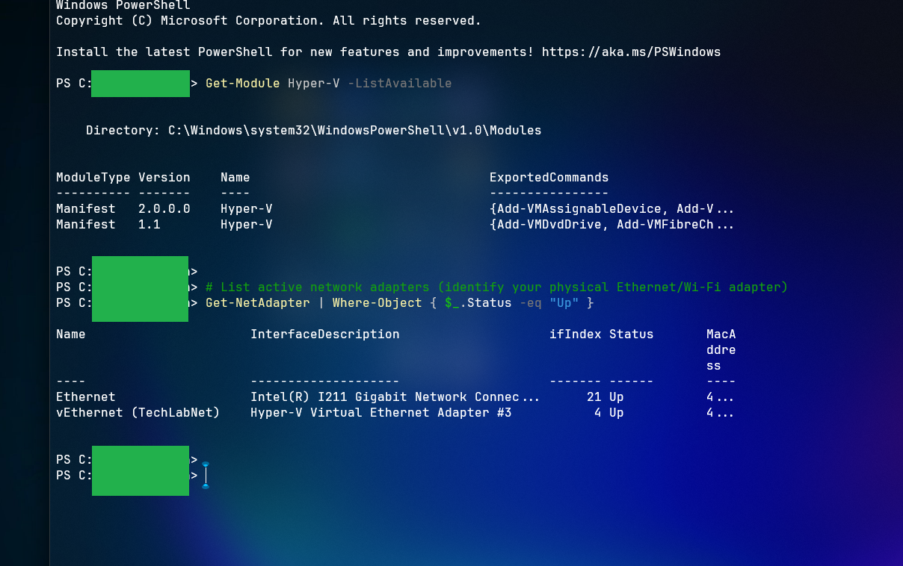

**Expected output:** Module name, version, and path displayed. If missing, Hyper-V role is not installed.

---

### 1.2 Enable Hyper-V Optional Features

Install Hyper-V role and management tools:

```powershell
Enable-WindowsOptionalFeature -Online -FeatureName Microsoft-Hyper-V-All
```

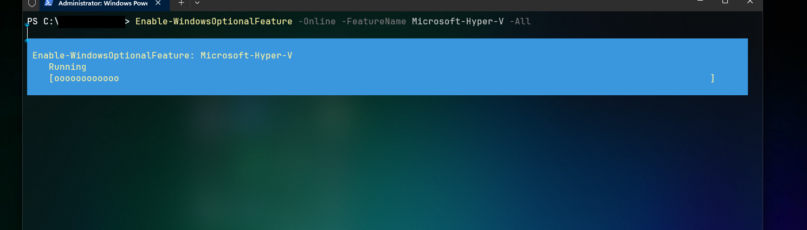

**What this installs:**
- Hyper-V hypervisor
- Hyper-V management tools (GUI and PowerShell)
- Virtual switch capability
- VM migration tools

**Note:** System restart required after installation.

---

### 1.3 Validate Hardware Virtualization

Confirm CPU virtualization extensions are enabled:

```powershell
systeminfo | findstr /C:"Virtualization"
```

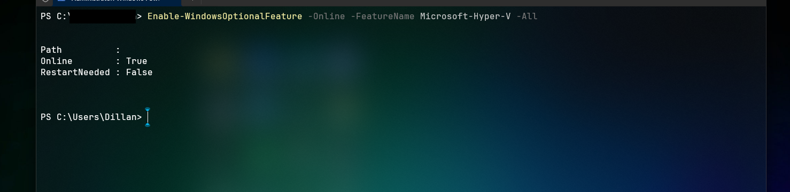

**Expected output:**
```
Hyper-V Requirements:      VM Monitor Mode Extensions: Yes
                           Virtualization Enabled In Firmware: Yes
                           Second Level Address Translation: Yes
                           Data Execution Prevention Available: Yes
```

**Troubleshooting:** If "Virtualization Enabled In Firmware: No", enter BIOS and enable:
- **Intel:** VT-x or Intel Virtualization Technology
- **AMD:** AMD-V or SVM Mode

---

## 2. VM Setup

### 2.1 Create VM Directory Structure

Organize VM files in dedicated directory:

```powershell
$VMName = "Win11Lab"
$VMPath = "D:\VMs\$VMName"
New-Item -ItemType Directory -Force -Path $VMPath
```

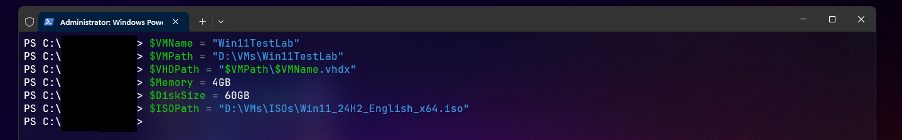

**Directory structure created:**
```
D:\VMs\Win11Lab\
├── Win11Lab.vhdx       (created in next step)
├── Checkpoints\        (auto-created by Hyper-V)
└── Virtual Machines\   (VM configuration files)
```

---

### 2.2 Create Generation 2 Virtual Machine

Deploy VM with Windows 11-compatible specifications:

```powershell
New-VM -Name $VMName `
    -Generation 2 `
    -MemoryStartupBytes 4GB `
    -NewVHDPath "$VMPath\$VMName.vhdx" `
    -NewVHDSizeBytes 60GB `
    -SwitchName "Bifrost"
```

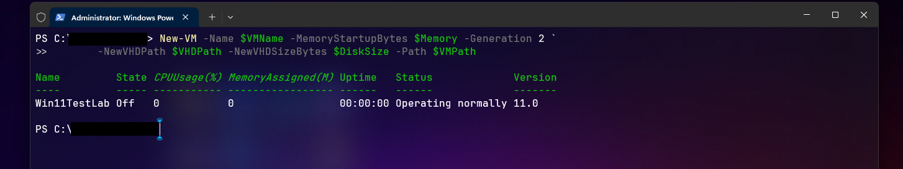

**Parameter explanation:**
- `-Generation 2` - UEFI firmware (required for Windows 11 TPM/Secure Boot)
- `-MemoryStartupBytes 4GB` - Minimum recommended for Windows 11
- `-NewVHDPath` - Creates dynamic VHDX (expands as needed, max 60GB)
- `-SwitchName "Bifrost"` - Connects to external network switch (created in Step 3)

---

### 2.3 Verify VM Creation

Confirm VM exists and displays correct properties:

```powershell
Get-VM -Name $VMName
```

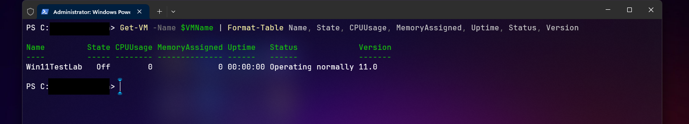

**Verify the following:**
- **State:** Off (ready for configuration)
- **Generation:** 2
- **MemoryStartup:** 4096 MB
- **Path:** Correct directory location

---

## 3. Network Configuration

### 3.1 Create External Virtual Switch

External switches bridge VMs to physical network for internet access:

```powershell
$switchName = "Bifrost"
$adapter = (Get-NetAdapter | Where-Object {$_.Status -eq "Up"}).Name

if (-not (Get-VMSwitch -Name $switchName -ErrorAction SilentlyContinue)) {
    New-VMSwitch -Name $switchName -NetAdapterName $adapter -AllowManagementOS $true
}

Get-VMSwitch -Name $switchName
```

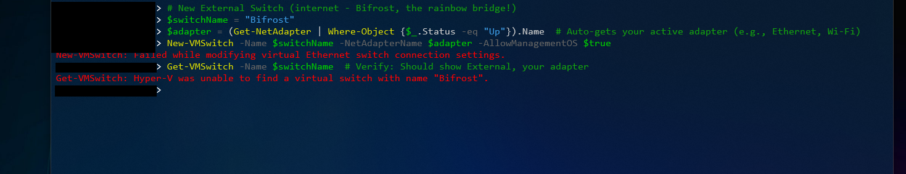

**What this does:**
- **Identifies active network adapter** (Ethernet or Wi-Fi with internet)
- **Creates external switch** bridged to that adapter
- **AllowManagementOS $true** - Host retains network access (important!)
- **Verifies switch creation** with Get-VMSwitch

**Network Types:**
- **External:** VM accesses physical network (internet, LAN)
- **Internal:** VM-to-VM and VM-to-host only (no internet)
- **Private:** VM-to-VM only (isolated)

---

### 3.2 Add Network Adapter to VM

Connect VM to the external switch:

```powershell
Add-VMNetworkAdapter -VMName $VMName -SwitchName $switchName
Get-VMNetworkAdapter -VMName $VMName | Format-Table Name, SwitchName, MacAddress, Status
```

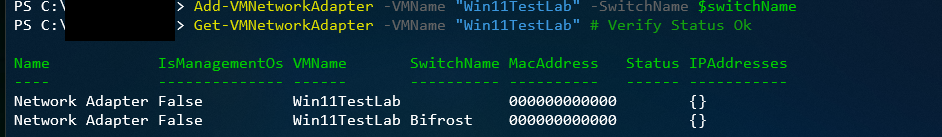

**Expected output:**
- **SwitchName:** Bifrost
- **MacAddress:** Auto-generated unique MAC
- **Status:** Shows adapter is attached (will be "OK" when VM runs)

---

## 4. Boot Order Configuration

### 4.1 Review Current Boot Order

Inspect firmware boot sequence:

```powershell
Get-VMFirmware -VMName $VMName | Select-Object -ExpandProperty BootOrder | Format-Table BootType, Device, ControllerType, ControllerNumber, ControllerLocation, Path
```

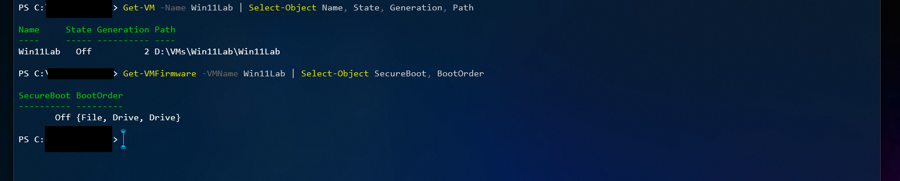

**Default Gen 2 boot order typically includes:**
1. Hard Drive (VHDX)
2. DVD Drive (if attached)
3. Network Adapter (PXE boot)

**Problem:** Network boot (PXE) causes installation loops if DVD isn't prioritized.

---

### 4.2 Set Boot Order: DVD First, Disk Second

Configure firmware to boot from installation media:

```powershell
Set-VMFirmware -VMName $VMName -BootOrder (Get-VMDvdDrive -VMName $VMName), (Get-VMHardDiskDrive -VMName $VMName)
```

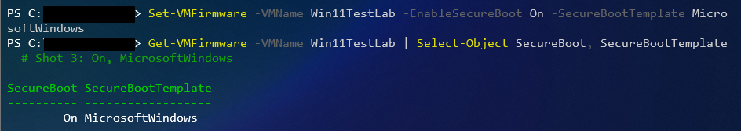

**What this does:**
- **DVD Drive first** - Boots Windows 11 ISO during installation
- **Hard Disk second** - Boots installed OS after setup
- **Removes network boot** - Prevents PXE loops

---

### 4.3 Verify Updated Boot Order

Confirm boot sequence changed:

```powershell
Get-VMFirmware -VMName $VMName | Select-Object -ExpandProperty BootOrder | Format-Table BootType, Device
```

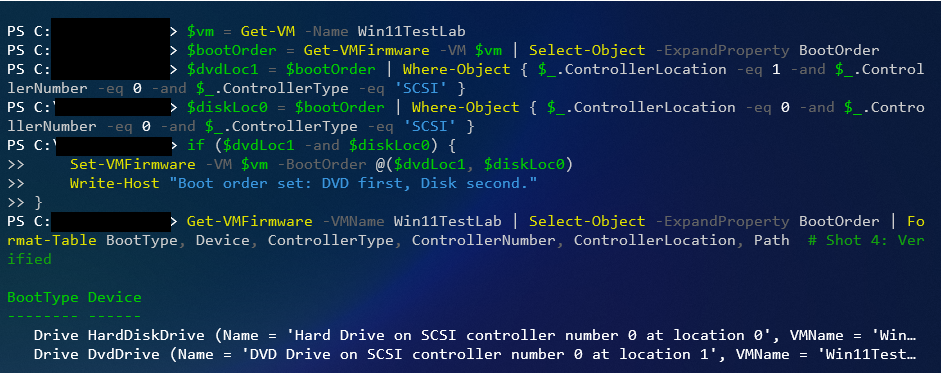

**Expected output:**
1. **DVD Drive** (File)
2. **Hard Disk Drive** (Drive)

**Critical for Windows 11 installation:** DVD must be first, or VM attempts network boot and hangs.

---

## 5. WSL2 Integration & Conflict Resolution

### 5.1 Understanding the Conflict

**Problem:** Hyper-V and WSL2 (Windows Subsystem for Linux 2) both use virtualization. WSL2 can:
- Interfere with Hyper-V VM performance
- Cause Hyper-V service startup failures
- Lock virtualization resources

**Solution:** Temporarily disable WSL2 during VM deployment, re-enable after.

---

### 5.2 Shutdown WSL2

Stop WSL2 virtual machine:

```powershell
wsl --shutdown
```

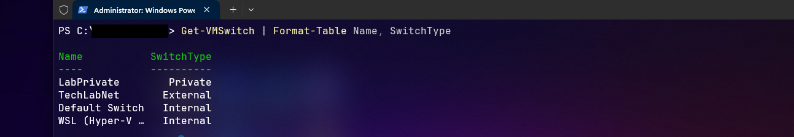

**Verify WSL2 is stopped:**
```powershell
wsl --status
```

**Expected output:**
```
No distributions are currently running.
```

---

### 5.3 Restart Hyper-V Service

Ensure Hyper-V has exclusive virtualization access:

```powershell
Restart-Service vmms
```

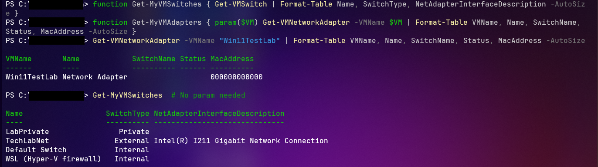

**Service name:** `vmms` (Virtual Machine Management Service)

**What this does:**
- Clears any WSL2 resource locks
- Reinitializes Hyper-V hypervisor
- Prepares environment for VM operations

---

### 5.4 Re-enable WSL2 (After VM Deployment)

Once VM is configured and running, restore WSL2:

```powershell
Enable-WindowsOptionalFeature -Online -FeatureName Microsoft-Windows-Subsystem-Linux
```


**Best practice:** Pause WSL2 only during Hyper-V operations, not permanently.

---

## 6. Verification Procedures

### 6.1 Comprehensive VM Status Check

Verify all VM components configured correctly:

```powershell
Get-VM -Name $VMName
```


**Check these properties:**
- **State:** Off (or Running if started)
- **CPUUsage:** 0% when off
- **MemoryAssigned:** Should match startup bytes
- **Uptime:** 00:00:00 if not yet started
- **Status:** Operating normally

---

### 6.2 Verify DVD Drive Configuration

Confirm installation media mounted:

```powershell
Get-VMDvdDrive -VMName $VMName
```

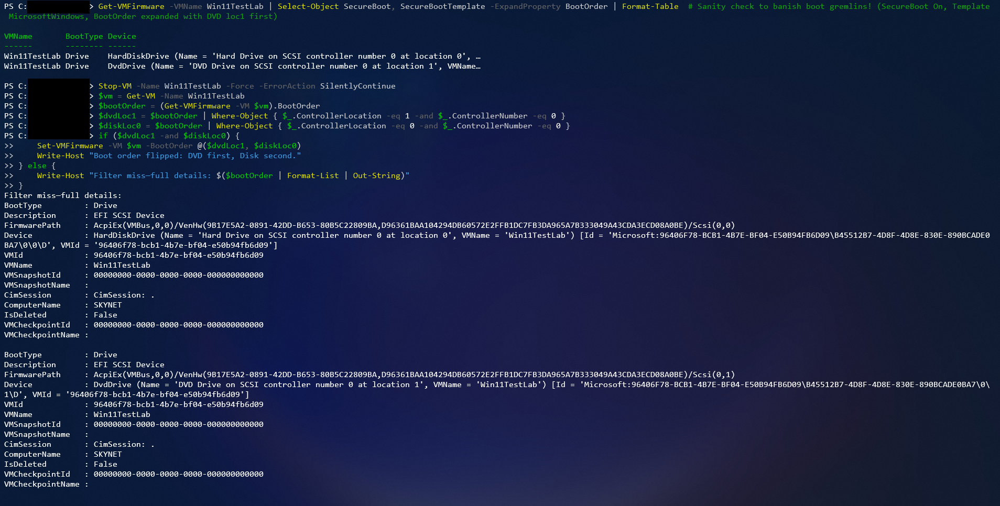

**Expected output:**
- **Path:** Location of Windows 11 ISO (if mounted)
- **ControllerLocation:** 1 (standard for Gen 2)

**If Path is null:** ISO not mounted. Mount with:
```powershell
Set-VMDvdDrive -VMName $VMName -Path "D:\ISOs\Win11_24H2_English_x64.iso"
```

---

### 6.3 Verify Firmware Settings

Inspect UEFI firmware configuration:

```powershell
Get-VMFirmware -VMName $VMName
```


**Critical settings for Windows 11:**
- **SecureBoot:** On (required for Windows 11)
- **SecureBootTemplate:** MicrosoftWindows
- **BootOrder:** DVD → Hard Disk (no network boot)

---

### 6.4 Verify Checkpoint Exists

Confirm rollback point created:

```powershell
Get-VMSnapshot -VMName $VMName
```

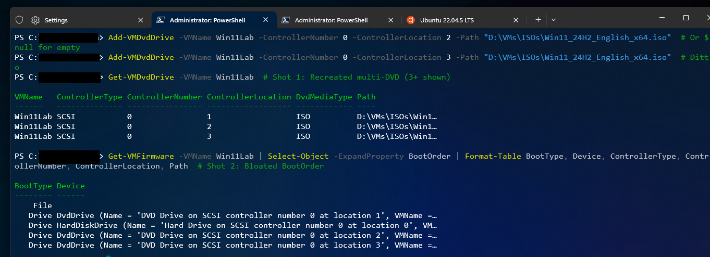

**Expected output:**
- **Name:** Checkpoint/snapshot name
- **SnapshotType:** Standard
- **CreationTime:** Timestamp of creation

**If no checkpoints exist:**
```powershell
Checkpoint-VM -Name $VMName -SnapshotName "Pre-Installation"
```

---

## 7. Comprehensive Troubleshooting

### 7.1 Common Issues and Solutions

| Issue | Symptom | Root Cause | Solution |
|-------|---------|------------|----------|
| **PXE Boot Loop** | VM hangs at "PXE-E53: No boot filename received" | Network boot enabled, DVD not prioritized | Remove network boot from firmware: `Set-VMFirmware -VMName $VMName -BootOrder (Get-VMDvdDrive -VMName $VMName), (Get-VMHardDiskDrive -VMName $VMName)` |
| **VM Won't Start** | Error: "Failed to start virtual machine" | WSL2 holding virtualization lock | Shutdown WSL2: `wsl --shutdown`, restart service: `Restart-Service vmms` |
| **No Internet in VM** | VM can't ping external sites | External switch not created/connected | Verify switch type: `Get-VMSwitch -Name "Bifrost"` should show `SwitchType: External`. Recreate if Internal. |
| **Secure Boot Error** | "Secure Boot violation" during boot | Incorrect Secure Boot template | Set correct template: `Set-VMFirmware -VMName $VMName -SecureBootTemplate MicrosoftWindows` |
| **TPM Not Found** | Windows 11 setup error: "This PC can't run Windows 11" | TPM not enabled on VM | Enable TPM: `Set-VMKeyProtector -VMName $VMName -NewLocalKeyProtector; Enable-VMTPM -VMName $VMName` |
| **Disk I/O Error** | VM reports disk errors | VHDX corruption or host disk full | Check host disk space. If corrupted, restore from checkpoint. |
| **Checkpoint Restore Fails** | Error applying checkpoint | Active VM or file lock | Stop VM: `Stop-VM -Name $VMName -Force`, then restore: `Restore-VMCheckpoint -Name "CheckpointName" -VMName $VMName -Confirm:$false` |

---

### 7.2 Network Troubleshooting

**Problem:** VM has network adapter but no internet access.

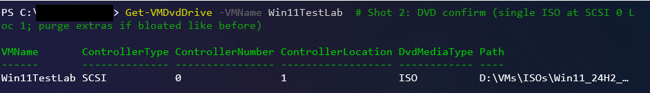

**Diagnostic steps:**

1. **Verify switch type:**
   ```powershell
   Get-VMSwitch -Name "Bifrost" | Select Name, SwitchType
   ```
   **Must be:** `External` (not Internal or Private)

2. **Check host internet:**
   ```powershell
   Test-Connection -ComputerName google.com -Count 2
   ```
   If host has no internet, VM won't either.

3. **Verify VM adapter connected:**
   ```powershell
   Get-VMNetworkAdapter -VMName $VMName | Select SwitchName, Status
   ```
   **SwitchName** should match external switch.

4. **Recreate external switch if needed:**
   ```powershell
   Remove-VMSwitch -Name "Bifrost" -Force
   $adapter = (Get-NetAdapter | Where-Object {$_.Status -eq "Up"}).Name
   New-VMSwitch -Name "Bifrost" -NetAdapterName $adapter -AllowManagementOS $true
   ```

---

### 7.3 Boot Order Issues

**Problem:** VM ignores DVD and attempts network boot.


**Diagnosis:**
```powershell
Get-VMFirmware -VMName $VMName | Select -ExpandProperty BootOrder
```

**If network boot appears in list:** Remove it.

**Solution:**
```powershell
# Get only DVD and Disk boot devices (excludes network)
$dvd = Get-VMDvdDrive -VMName $VMName
$disk = Get-VMHardDiskDrive -VMName $VMName

# Set boot order with ONLY these devices
Set-VMFirmware -VMName $VMName -BootOrder $dvd, $disk
```

**Verify:**
```powershell
Get-VMFirmware -VMName $VMName | Select -ExpandProperty BootOrder | Format-Table BootType
```

**Expected output:** Only "File" (DVD) and "Drive" (Disk). No "Network".

---

### 7.4 WSL2 Conflict Resolution

**Problem:** Hyper-V service won't start or VMs perform poorly.

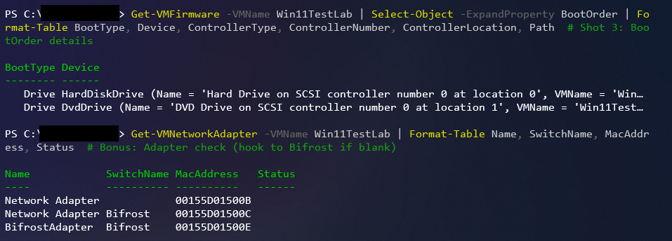

**Symptoms:**
- `Get-VM` returns errors
- VMs won't start
- vmms service fails to start

**Root cause:** WSL2 and Hyper-V competing for virtualization resources.

**Solution sequence:**

1. **Check WSL2 status:**
   ```powershell
   wsl --status
   ```

2. **Shutdown WSL2:**
   ```powershell
   wsl --shutdown
   ```

3. **Verify WSL2 stopped:**
   ```powershell
   wsl --status
   ```
   Should show: "No distributions are currently running."

4. **Restart Hyper-V:**
   ```powershell
   Restart-Service vmms
   ```

5. **Test VM operations:**
   ```powershell
   Get-VM -Name $VMName
   ```

**Permanent solution (if you don't need WSL2):**
```powershell
Disable-WindowsOptionalFeature -Online -FeatureName Microsoft-Windows-Subsystem-Linux
```

---

### 7.5 Checkpoint Rollback

**Problem:** VM configuration broken, need to restore previous state.

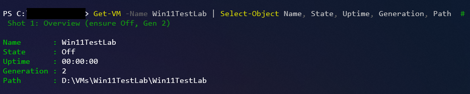

**List available checkpoints:**
```powershell
Get-VMSnapshot -VMName $VMName | Select Name, CreationTime
```

**Restore checkpoint:**
```powershell
Restore-VMCheckpoint -Name "Pre-Installation" -VMName $VMName -Confirm:$false
```

**Alternative (GUI method):**
1. Hyper-V Manager → Select VM
2. Right-click checkpoint → Apply
3. Choose "Apply" (not "Apply and Delete Checkpoint")

**Best practice:** Create checkpoints before major changes:
```powershell
Checkpoint-VM -Name $VMName -SnapshotName "Before-Update-$(Get-Date -Format 'yyyyMMdd-HHmm')"
```

---

### 7.6 Additional Troubleshooting Resources

**Firmware errors:**

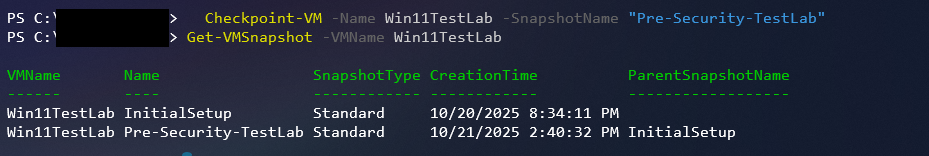

**Common fixes:**
- Reset to defaults: `Set-VMFirmware -VMName $VMName -EnableSecureBoot Off` (then re-enable)
- Check boot order (see Section 7.3)
- Verify TPM enabled (see Section 7.1)

**Licensing issues:**

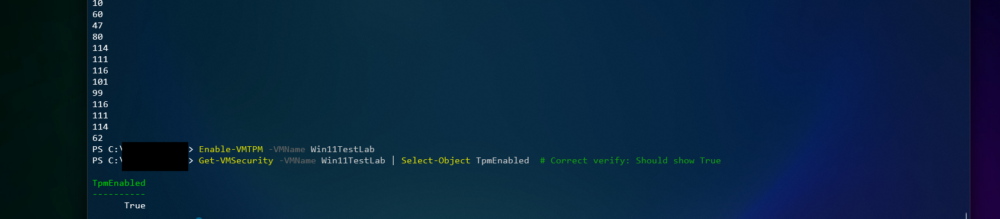

**Windows 11 activation:**
- Generic Pro key: `VK7JG-NPHTM-C97JM-9MPGT-3V66T`
- Activate: `slmgr /ipk VK7JG-NPHTM-C97JM-9MPGT-3V66T` then `slmgr /ato`
- Check status: `slmgr /xpr`

---

## 8. PowerShell Automation

### 8.1 Custom Hyper-V Query Functions

Simplified commands for common VM operations:

```powershell
# Auto-import Hyper-V module
Import-Module Hyper-V -ErrorAction SilentlyContinue

function Get-MyVMSwitches {
    Get-VMSwitch | Format-Table Name, SwitchType, NetAdapterInterfaceDescription -AutoSize
}

function Get-MyVMAdapters {
    param($VM)
    Get-VMNetworkAdapter -VMName $VM | Format-Table VMName, Name, SwitchName, Status, MacAddress -AutoSize
}

function Show-MyAntics {
    Write-Host "Your PC Powers:"
    Write-Host "- VM Switches: Get-MyVMSwitches"
    Write-Host "- VM Adapters: Get-MyVMAdapters 'VMName'"
    Write-Host "- Create Win11 VM: New-Win11VM"
    Write-Host "- More: Add your scripts here"
}
```

**Usage examples:**
```powershell
Get-MyVMSwitches                    # List all virtual switches
Get-MyVMAdapters -VM "Win11Lab"     # Show VM network configuration
```

---

### 8.2 Automated VM Deployment Script

<details>
<summary><strong>Click to expand: New-Win11VM Function (Full Script)</strong></summary>

**Complete automation for Windows 11 VM creation with safety mechanisms.**

```powershell
function New-Win11VM {
    <#
    .SYNOPSIS
        Automated Windows 11 Gen 2 VM Creation and Setup for Hyper-V Lab/Portfolio.
    .DESCRIPTION
        Creates a fresh Win11 VM with TPM, Secure Boot, external network switch for internet, and checkpoints.
        Handles cleanup, boot order, and common troubleshooting (e.g., PXE loops, sys req bypass).
        Assumes ISO downloaded/verified (use Get-FileHash -Algorithm SHA256 for integrity).
    .EXAMPLE
        New-Win11VM
    .NOTES
        Author: Dillan Roby – A+ Certified Portfolio Piece
        Paths: Customize variables as needed.
        Post-run: GUI install, then eject ISO, flip boot order, activate.
    #>
    # Variables – Customize here
    $vmName = "Win11TestLab"
    $vmPath = "D:\VMs\$vmName"
    $vhdPath = "$vmPath\$vmName.vhdx"
    $isoPath = "D:\VMs\ISOs\Win11_24H2_English_x64.iso"
    $switchName = "Bifrost" # External switch for internet sharing
    $memory = 4GB
    $diskSize = 60GB
    $processorCount = 2
    $checkpointName = "Fresh-Create"

    # Safety prompt before cleanup
    $confirm = Read-Host "WARNING: This will stop and remove any existing VM named '$vmName' and delete its files. Proceed? (Y/N)"
    if ($confirm -ne 'Y' -and $confirm -ne 'y') {
        Write-Host "Operation aborted. No changes made." -ForegroundColor Red
        return
    }

    # Check for WSL2 conflict (Hyper-V can't nest virt easily)
    if ((Get-WindowsOptionalFeature -Online -FeatureName Microsoft-Windows-Subsystem-Linux).State -eq 'Enabled') {
        Write-Warning "WSL2 detected – may conflict with Hyper-V. Disabling temporarily."
        Disable-WindowsOptionalFeature -Online -FeatureName Microsoft-Windows-Subsystem-Linux -NoRestart
        Write-Host "Restart host if needed, then rerun function."
    }

    # Cleanup old VM/files
    Write-Host "Scrapping old VM if exists..."
    Stop-VM -Name $vmName -Force -ErrorAction SilentlyContinue
    Remove-VM -Name $vmName -Force -ErrorAction SilentlyContinue
    Remove-Item -Path $vhdPath -Force -ErrorAction SilentlyContinue
    Remove-Item -Path $vmPath -Recurse -Force -ErrorAction SilentlyContinue

    # Create directories
    New-Item -ItemType Directory -Path $vmPath -Force | Out-Null

    # Create external switch if not exists
    $adapter = Get-NetAdapter | Where-Object { $_.Status -eq "Up" } | Select-Object -First 1
    if (-not (Get-VMSwitch -Name $switchName -ErrorAction SilentlyContinue)) {
        Write-Host "Creating external switch '$switchName' on $($adapter.Name)..."
        New-VMSwitch -Name $switchName -NetAdapterName $adapter.Name -AllowManagementOS $true
    }

    # Create VM
    Write-Host "Creating Gen 2 VM..."
    New-VM -Name $vmName -Path $vmPath -NewVHDPath $vhdPath -NewVHDSizeBytes $diskSize -Generation 2 -MemoryStartupBytes $memory
    Set-VM -Name $vmName -ProcessorCount $processorCount

    # Enable TPM with key protector
    Set-VMKeyProtector -VMName $vmName -NewLocalKeyProtector
    Enable-VMTPM -VMName $vmName

    # Secure Boot
    Set-VMFirmware -VMName $vmName -EnableSecureBoot On -SecureBootTemplate MicrosoftWindows

    # Attach network adapter
    Add-VMNetworkAdapter -VMName $vmName -SwitchName $switchName

    # Mount ISO to DVD drive
    Add-VMDvdDrive -VMName $vmName -ControllerNumber 0 -ControllerLocation 1
    Set-VMDvdDrive -VMName $vmName -ControllerNumber 0 -ControllerLocation 1 -Path $isoPath

    # Set boot order: DVD first, strip PXE/network to avoid loops
    $dvd = Get-VMDvdDrive -VMName $vmName
    $disk = Get-VMHardDiskDrive -VMName $vmName
    if ($dvd -and $disk) {
        Set-VMFirmware -VMName $vmName -BootOrder $dvd, $disk # Only DVD and disk – no network/PXE
        Write-Host "Boot order set: DVD first for install (PXE stripped)."
    }

    # Checkpoint fresh state
    Checkpoint-VM -Name $vmName -SnapshotName $checkpointName
    Write-Host "Checkpoint '$checkpointName' created."

    # Output next steps
    Write-Host "VM rebuilt successfully. Next:"
    Write-Host "1. Start via Hyper-V Manager GUI (better timing for 'press key' prompt)."
    Write-Host "2. Install: English US, skip product key, Custom install to VHDX."
    Write-Host "3. If sys req error: Shift+F10 > cmd > reg add HKLM\SYSTEM\Setup\LabConfig /v BypassTPMCheck /t REG_DWORD /d 1 /f"
    Write-Host " (Add /v BypassSecureBootCheck /d 1 /f and /v BypassRAMCheck /d 1 /f if needed)."
    Write-Host "4. Post-install: Eject ISO (Set-VMDvdDrive -VMName $vmName -Path `$null)"
    Write-Host "5. Flip boot: Set-VMFirmware -VMName $vmName -BootOrder $disk, $dvd"
    Write-Host "6. Activate: VK7JG-NPHTM-C97JM-9MPGT-3V66T (generic Pro key)."
    Write-Host "7. Verify network: ping google.com"
    Write-Host "8. Checkpoint: Checkpoint-VM -Name $vmName -SnapshotName 'Post-Install-Online'"
    Write-Host "Run Start-Process vmconnect.exe -ArgumentList 'localhost', $vmName to connect."
}
```

</details>

**Key features:**
- ✅ Safety confirmation before deletion
- ✅ WSL2 conflict detection and resolution
- ✅ Automatic external switch creation
- ✅ TPM and Secure Boot enablement
- ✅ Boot order configuration (no PXE loops)
- ✅ Automatic checkpoint creation
- ✅ Detailed post-installation instructions

**Usage:**
```powershell
New-Win11VM
```

**Available in repository:** Full script saved as `New-Win11VM.ps1` for easy deployment.

---

### 8.3 Interactive Tools Menu

Load custom functions on PowerShell startup:

```powershell
Set-Alias -Name tools -Value Show-ToolsMenu

function Show-ToolsMenu {
    $response = Read-Host "Would you like to access your tools? (Y/N)"
    if ($response -eq 'Y' -or $response -eq 'y') {
        Write-Host "Loading tools menu..." -ForegroundColor Green
        Show-MyAntics
        $choice = Read-Host "Enter a tool name to run (or 'exit')"
        switch ($choice) {
            "Get-MyVMSwitches" { Get-MyVMSwitches }
            "Get-MyVMAdapters" {
                $vm = Read-Host "Enter VM name"
                Get-MyVMAdapters $vm
            }
            "New-Win11VM" { New-Win11VM }
            "exit" { Write-Host "Exiting menu." }
            default { Write-Host "Invalid choice. Try again." }
        }
    } else {
        Write-Host "Tools access skipped." -ForegroundColor Yellow
    }
}

# Load on startup
Write-Host "Custom Hyper-V functions loaded: Get-MyVMSwitches, Get-MyVMAdapters, Show-MyAntics" -ForegroundColor Green
Write-Host "Alias 'tools' ready for interactive menu. Type 'tools' to launch." -ForegroundColor Green
```

**Add to PowerShell profile for persistent loading:**
```powershell
notepad $PROFILE
```

Paste functions, save, and reload terminal. Functions now available in every PowerShell session.

---

## 9. Skills Demonstrated

### Virtualization & Infrastructure
- ✅ **Hyper-V Management** - VM lifecycle management from creation to checkpoint recovery
- ✅ **Generation 2 VMs** - UEFI firmware, TPM, Secure Boot (Windows 11 requirements)
- ✅ **Virtual Networking** - External switches, adapter configuration, internet routing
- ✅ **Storage Management** - Dynamic VHDX creation, disk allocation, file organization
- ✅ **Checkpoint Strategy** - Backup points for rollback and disaster recovery

### PowerShell Scripting & Automation
- ✅ **Custom Functions** - Reusable commands for VM operations
- ✅ **Error Handling** - Safety confirmations, input validation, graceful failures
- ✅ **Interactive Menus** - User-friendly CLI interfaces for complex tasks
- ✅ **Automation Pipelines** - Full VM deployment from single command
- ✅ **Parameter Management** - Customizable variables for different environments

### Operating Systems
- ✅ **Windows 11 Deployment** - Installation, configuration, activation
- ✅ **UEFI/BIOS Configuration** - Boot order, firmware settings, hardware requirements
- ✅ **TPM Management** - Trusted Platform Module enablement and configuration
- ✅ **Secure Boot** - Certificate management, boot integrity validation

### Networking
- ✅ **Virtual Switch Types** - External (internet), Internal (host+VM), Private (VM-only)
- ✅ **Network Adapter Configuration** - MAC addresses, switch binding, status verification
- ✅ **Internet Routing** - Bridge configuration, NAT, host network sharing
- ✅ **Connectivity Troubleshooting** - Ping tests, adapter status, switch verification

### Troubleshooting & Problem-Solving
- ✅ **Boot Loop Resolution** - PXE boot issues, boot order corrections
- ✅ **Conflict Resolution** - WSL2/Hyper-V resource conflicts, service management
- ✅ **Diagnostic Methodology** - Systematic approach to identifying root causes
- ✅ **Rollback Procedures** - Checkpoint restoration, configuration recovery

### Documentation & Knowledge Transfer
- ✅ **Technical Writing** - Step-by-step guides with command examples
- ✅ **Visual Documentation** - Screenshot integration for verification steps
- ✅ **Troubleshooting Guides** - Common issues with tested solutions
- ✅ **Code Documentation** - Function headers, parameter explanations, usage examples

---

## Real-World Applications

### What This Proves to Employers

**Beyond "I used Hyper-V once":**

This project demonstrates capabilities required for:

**IT Infrastructure Roles:**
- Test lab creation for software validation
- Development environment provisioning
- Disaster recovery system testing
- Multi-environment deployment strategies

**Systems Administration:**
- Server virtualization management (concepts apply to VMware ESXi, Proxmox)
- Backup and recovery procedures
- Network segmentation and isolation
- Automated provisioning pipelines

**DevOps & Cloud Engineering:**
- Infrastructure-as-Code principles (PowerShell automation)
- Repeatable deployment procedures
- Configuration management
- Environment consistency enforcement

**Technical Support:**
- Advanced troubleshooting methodology
- Root cause analysis
- Service conflict resolution
- Customer-facing technical documentation

---

## Project Expansion Ideas

### Intermediate Enhancements
- **Multiple VM deployment** - Create domain controller + member server lab
- **Network isolation** - Internal switch for isolated test networks
- **Automated snapshots** - Scheduled checkpoint creation via Task Scheduler
- **Resource monitoring** - PowerShell scripts to track VM resource usage

### Advanced Enhancements
- **Nested virtualization** - Run Hyper-V inside Hyper-V VM (Docker in VM)
- **High availability** - Live migration between Hyper-V hosts
- **Backup automation** - Scheduled VM exports with retention policies
- **Infrastructure-as-Code** - Terraform or ARM templates for Azure VM deployment

---

## Resources & Further Learning

### Official Microsoft Documentation
- **Hyper-V on Windows:** https://docs.microsoft.com/en-us/virtualization/hyper-v-on-windows/
- **PowerShell Hyper-V Module:** https://docs.microsoft.com/en-us/powershell/module/hyper-v/
- **Windows 11 System Requirements:** https://www.microsoft.com/en-us/windows/windows-11-specifications

### Community Resources
- **r/HyperV** - Reddit community for Hyper-V discussions
- **TechNet Forums** - Microsoft community support
- **PowerShell.org** - PowerShell scripting resources

### Related Projects
- **VMware ESXi Lab** - Enterprise hypervisor alternative
- **Proxmox VE** - Open-source virtualization platform
- **Azure Virtual Machines** - Cloud-based VM deployment

---

## Contributing

This guide is open to contributions. If you encounter issues not covered or have improvements:

1. Fork the repository
2. Create a feature branch (`git checkout -b feature/improved-troubleshooting`)
3. Commit your changes (`git commit -m 'Added solution for X issue'`)
4. Push to branch (`git push origin feature/improved-troubleshooting`)
5. Open a Pull Request

**Areas for contribution:**
- Additional troubleshooting scenarios
- Alternative network configurations
- Script optimizations
- Translation to other languages

---

## Photo Reference Guide

**Note:** The detailed photo map (48 screenshots) has been moved to [`PHOTO_REFERENCE.md`](PHOTO_REFERENCE.md) for better organization.

**Quick reference:**
- Screenshots 01-03: Prerequisites
- Screenshots 06-08: VM Setup
- Screenshots 24-25: Network Configuration
- Screenshots 30, 37-38: Boot Order
- Screenshots 17-19: WSL2 Management
- Screenshots 23-26: Verification
- Screenshots 27-36: Troubleshooting

All screenshots referenced in this guide are available in the `screenshots/` directory.

---

## License & Disclaimer

**Documentation License:** MIT License - Free to use, modify, and distribute with attribution.

**Software Used:**
- Windows 11 - Microsoft End User License Agreement applies
- Hyper-V - Included with Windows Pro/Enterprise, no additional licensing
- PowerShell - Open-source, MIT License

**Disclaimer:**
This guide is provided for educational purposes. Always verify commands before execution in production environments. The author is not responsible for data loss or system issues resulting from following this guide. Test in isolated lab environments first.

---

## Project Author

**Dillan Roby**  
**GitHub:** https://github.com/DillanR1  
**Repository:** https://github.com/DillanR1/Hyper-V-Windows11-VM-Guide  
**LinkedIn:** linkedin.com/in/dillan-roby/

**Core Competencies:**
- Hyper-V virtualization and advanced configuration
- PowerShell automation and scripting
- Windows 11 deployment and troubleshooting
- Virtual networking and infrastructure design
- Technical documentation and knowledge transfer

**Certification Track:**
- CompTIA A+ (Certified)
- CompTIA Network+ (Certified)
- CompTIA Security+ (In Progress)

---

## Feedback & Support

**Found this guide helpful?** Star the repository on GitHub!

**Issues or questions?**
- Open an issue: https://github.com/DillanR1/Hyper-V-Windows11-VM-Guide/issues
- Email: dillanroby1@gmail.com
- LinkedIn: linkedin.com/in/dillan-roby/

**Want to see more projects?** Check out my other lab guides:
- [Active Directory Lab (Windows Server 2022)](https://github.com/DillanR1/Windows-Server-Active-Directory)
- [osTicket Deployment (Linux LAMP Stack)](https://github.com/DillanR1/osTicket-lab)

---

*This deployment guide was field-tested through multiple build/break/rebuild cycles to document real-world issues and their solutions. Last updated: July 2026*

**Remember:** The best way to learn virtualization is to break things intentionally, then fix them. That's how this guide was created.
