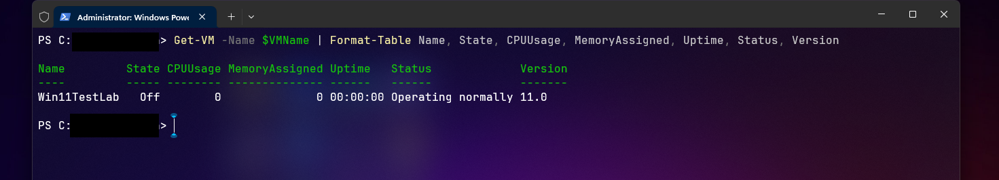
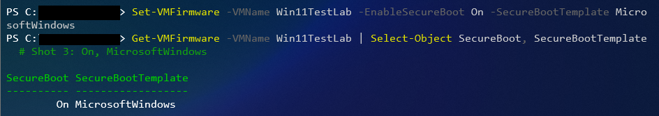
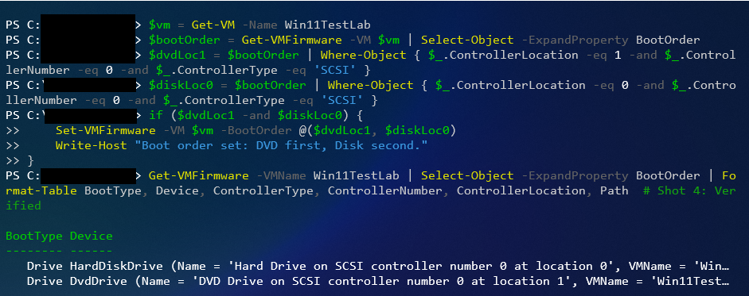
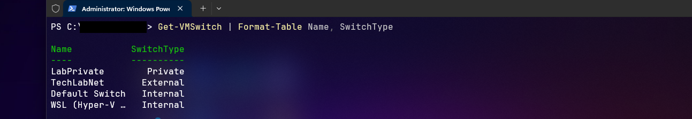
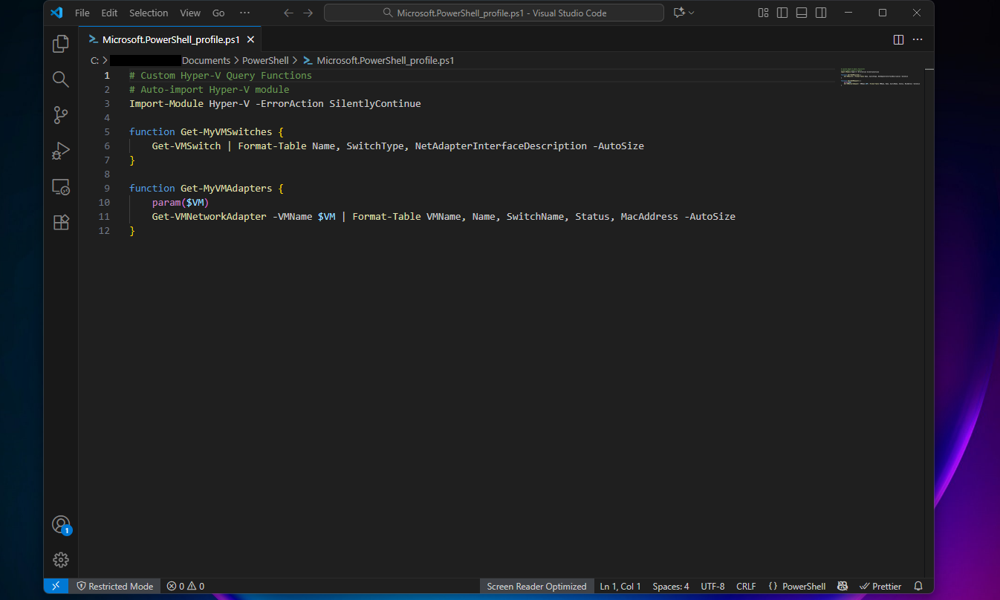
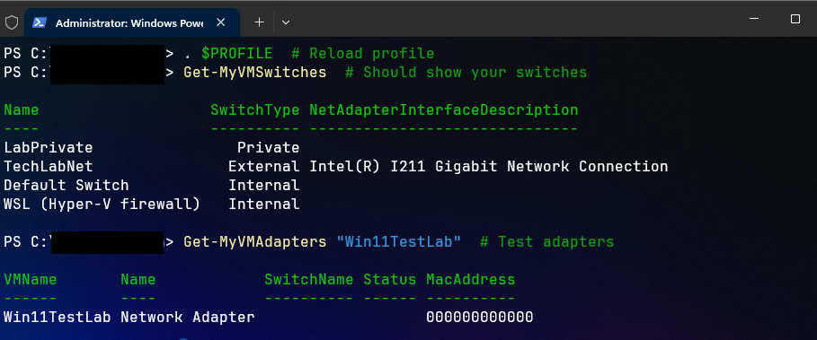

# Windows 11 Hyper-V Lab: Tactical Field Guide

**Author:** Dillan R.  
**Repository:** [Hyper-V-Windows11-VM-Guide](https://github.com/DillanR1/Hyper-V-Windows11-VM-Guide)  
**Date:** October 22, 2025 (Finalized 1:10 PM PDT)  
**Tone:** Tactical, experiential, portfolio-ready.

---

## Table of Contents
1. [Overview](#1-overview)  
2. [Prerequisites](#2-prerequisites)  
3. [VM Setup](#3-vm-setup)  
4. [Network Configuration](#4-network-configuration)  
5. [Boot Order Configuration](#5-boot-order-configuration)  
6. [WSL Integration & Caveats](#6-wsl-integration--caveats)  
7. [Verification](#7-verification)  
8. [Troubleshooting](#8-troubleshooting)  
9. [Advanced Features](#9-advanced-features)  
10. [Appendix: Photo Map & Notes](#10-appendix-photo-map--notes)

---

## 1. Overview

This guide documents the **creation of a Windows 11 Gen 2 VM on Hyper-V**, refined over multiple late-night field tests. I intentionally broke, re-built, and debugged every step so that you won't hit the same roadblocks—PXE loops, WSL conflicts, ISO mis-mounts, you name it.  

You’ll walk away with reproducible steps for **VM creation, external networking, boot order control, TPM/Secure Boot enablement, WSL coexistence, checkpoints, verification, and troubleshooting**—all in a tactical, field-lab style.  

> I messed this up more times than I can count, so consider this a field-tested map.

---

## 2. Prerequisites

**Environment**
- Windows 11 Pro/Enterprise with Hyper-V enabled  
- 16+ GB RAM (32 GB recommended for heavier labs)  
- Administrative PowerShell access

### Verify Hyper-V Modules

```powershell
Get-Module -ListAvailable Hyper-V
```

 

### Enable Hyper-V Optional Features

```powershell
Enable-WindowsOptionalFeature -Online -FeatureName Microsoft-Hyper-V-All
```

  

### Validate Hardware Virtualization

```powershell
systeminfo | find "Virtualization"
```

  

> **Pro Tip:** BIOS virtualization must be enabled. Hyper-V won’t warn you—it just fails silently.

---

## 3. VM Setup

### Directory & VHD Prep

```powershell
$VMName = "Win11Lab"
$VMPath = "D:\VMs\$VMName"
New-Item -ItemType Directory -Force -Path $VMPath
```

  

### Create the Virtual Machine

```powershell
New-VM -Name $VMName -Generation 2 -MemoryStartupBytes 4GB -NewVHDPath "$VMPath\$VMName.vhdx" -NewVHDSizeBytes 60GB -SwitchName "Bifrost"
```

  

```powershell
Get-VM -Name $VMName
```

  

---

## 4. Network Configuration

### Create External Switch

```powershell
$switchName = "Bifrost"
$adapter = (Get-NetAdapter | Where-Object {$_.Status -eq "Up"}).Name
if (-not (Get-VMSwitch -Name $switchName -ErrorAction SilentlyContinue)) {
    New-VMSwitch -Name $switchName -NetAdapterName $adapter -AllowManagementOS $true
}
Get-VMSwitch -Name $switchName
```

 
 

#

### Add VM Network Adapter

```powershell
Add-VMNetworkAdapter -VMName $VMName -SwitchName $switchName
Get-VMNetworkAdapter -VMName $VMName | Format-Table Name, SwitchName, MacAddress, Status
```

  
---

## 5. Boot Order Configuration

### Review Current Boot Order

```powershell
Get-VMFirmware -VMName $VMName | Select-Object -ExpandProperty BootOrder | Format-Table BootType, Device, ControllerType, ControllerNumber, ControllerLocation, Path
```

 

### DVD First, Disk Second

```powershell
Set-VMFirmware -VMName $VMName -BootOrder (Get-VMDvdDrive -VMName $VMName), (Get-VMHardDiskDrive -VMName $VMName)
```

  
 

> PXE loops are a late-night headache. Strip the network boot unless needed.

---

## 6. WSL Integration & Caveats

### Shutdown WSL2 to Avoid Conflicts

```powershell
wsl --shutdown
Restart-Service hvservice
```

   
 

### Re-enable WSL

```powershell
Enable-WindowsOptionalFeature -Online -FeatureName Microsoft-Windows-Subsystem-Linux
```

 

>> # Hyper-V and WSL2 fight over virtualization resources. Always shut down WSL before building a VM.

---

## 7. Verification

```powershell
Get-VM -Name $VMName
Get-VMDvdDrive -VMName $VMName
Get-VMFirmware -VMName $VMName
Get-VMSnapshot -VMName $VMName
```

    
    
    
 

**Checklist:**
- ✅ VM exists and is recognized  
- ✅ ISO mounted/unmounted correctly  
- ✅ Boot order correct  
- ✅ Snapshot exists and can rollback  

---

## 8. Troubleshooting (UNDER CONSTRUCTION - TROUBLESHOOTING THE TROUBLESHOOTER)

| Issue | Symptom | Fix |
|-------|----------|-----|
| Boot Loop Persistence | PXE loops | Roll back checkpoint |
| Backup Path Locked | Access denied | Adjust file permissions |
| Secure Boot Rollback | VM fails to boot | Disable Secure Boot temporarily |
| Network Failure | Internet unreachable | Recreate external switch |
| Disk Error | IO failures | Check disk health |
| Git Branch Swap | Default branch not main | `git branch -m master main` |
| Boot Loop Error | VM hangs at PXE | Strip network boot, force DVD |

   
   
   
   
   
   
   
   
   
 

---

## 9. Advanced Features

### Impressive Custom Script

**Customize** `$vmName, $vmPath, $isoPath, $switchName`; edit adapter if needed. Steps:  
1. Save as `.ps1`  
2. Run as Administrator  
3. Follow prompts

  
 
 

# Script Optimization
The functions above have been aliased in the .ps1 file. Instead of manually typing: 
> Get-VMSwitch | Format-Table Name, SwitchType, NetAdapterInterfaceDescription -AutoSize
>
All we have to do now is call the function 
>Get-MyVMSwitches
>

I have added this script to a larger - more impressive utility script that fires when the powershell terminal is first opened. The benefit here is that when I am spinning up VM's in the windows OS -I have a constant reminder of where all of my tools and utilities are.

```powershell
# Custom Hyper-V Query Functions
# Auto-import Hyper-V module
Import-Module Hyper-V -ErrorAction SilentlyContinue
function Get-MyVMSwitches {
    Get-VMSwitch | Format-Table Name, SwitchType, NetAdapterInterfaceDescription -AutoSize
}
function Get-MyVMAdapters {
    param($VM)
    Get-VMNetworkAdapter -VMName $VM | Format-Table VMName, Name, SwitchName, Status, MacAddress -AutoSize
}
function Show-MyAntics {
    Write-Host "Your PC Powers:"
    Write-Host "- VM Switches: Get-MyVMSwitches"
    Write-Host "- VM Adapters: Get-MyVMAdapters 'VMName'"
    Write-Host "- Create Win11 VM: New-Win11VM"
    Write-Host "- More: Add your scripts here"
}
function Show-ToolsMenu {
    $response = Read-Host "Would you like to access your tools? (Y/N)"
    if ($response -eq 'Y' -or $response -eq 'y') {
        Write-Host "Loading tools menu..." -ForegroundColor Green
        Show-MyAntics
        $choice = Read-Host "Enter a tool name to run (or 'exit')"
        switch ($choice) {
            "Get-MyVMSwitches" { Get-MyVMSwitches }
            "Get-MyVMAdapters" {
                $vm = Read-Host "Enter VM name"
                Get-MyVMAdapters $vm
            }
            "New-Win11VM" { New-Win11VM }
            "exit" { Write-Host "Exiting menu." }
            default { Write-Host "Invalid choice. Try again." }
        }
    } else {
        Write-Host "Tools access skipped." -ForegroundColor Yellow
    }
}
Set-Alias -Name tools -Value Show-ToolsMenu
Write-Host "Custom Hyper-V functions loaded: Get-MyVMSwitches, Get-MyVMAdapters, Show-MyAntics" -ForegroundColor Green
Write-Host "Script path: $PSScriptRoot" -ForegroundColor Cyan
Write-Host "Alias 'tools' ready for interactive menu. Type 'tools' to launch." -ForegroundColor Green
# NO AUTO-TRIGGER HERE – Call manually with 'tools'
# VM Creation Function (New-Win11VM) – Cutoff accepted at line 7 post-activation key
```
---

## 10. Appendix: Photo Map & Notes

| Photo | Section | Description | Upload Prompt |
|-------|---------|-------------|---------------|
| 01.png | Prerequisites | Verify Hyper-V module availability | [Upload 01.png to screenshots/] |
| 02.png | Prerequisites | Enable Hyper-V optional features | [Upload 02.png to screenshots/] |
| 03.png | Prerequisites | Check hardware virtualization support | [Upload 03.png to screenshots/] |
| 04.png | VM Setup | Create VM directory and VHD | [Upload 04.png to screenshots/] |
| 05.png | VM Setup | Create Gen 2 VM with initial settings | [Upload 05.png to screenshots/] |
| 06.png | VM Setup | Verify VM creation | [Upload 06.png to screenshots/] |
| 07.png | ISO Mounting | Add DVD drive and mount ISO | [Upload 07.png to screenshots/] |
| 08.png | ISO Mounting | Set DVD drive path for boot | [Upload 08.png to screenshots/] |
| 09.png | ISO Mounting | Verify DVD drive | [Upload 09.png to screenshots/] |
| 10.png | Network | Create external virtual switch | [Upload 10.png to screenshots/] |
| 11.png | Network | Verify switch creation | [Upload 11.png to screenshots/] |
| 12.png | Network | Add network adapter to VM | [Upload 12.png to screenshots/] |
| 13.png | Network | Verify VM network adapter | [Upload 13.png to screenshots/] |
| 14.png | Boot Order | Inspect current VM firmware boot order | [Upload 14.png to screenshots/] |
| 15.png | Boot Order | Set boot order: DVD first, disk second | [Upload 15.png to screenshots/] |
| 16.png | Boot Order | Confirm updated boot order | [Upload 16.png to screenshots/] |
| 17.png | WSL | Shutdown WSL2 to avoid conflicts | [Upload 17.png to screenshots/] |
| 18.png | WSL | Restart Hyper-V service after WSL shutdown | [Upload 18.png to screenshots/] |
| 19.png | WSL | Re-enable WSL optional feature | [Upload 19.png to screenshots/] |
| 20.png | Start | Take VM checkpoint | [Upload 20.png to screenshots/] |
| 21.png | Start | Start VM | [Upload 21.png to screenshots/] |
| 22.png | Start | Connect to VM console | [Upload 22.png to screenshots/] |
| 23.png | Verification | Verify VM exists | [Upload 23.png to screenshots/] |
| 24.png | Verification | Verify DVD drive status | [Upload 24.png to screenshots/] |
| 25.png | Verification | Verify firmware settings | [Upload 25.png to screenshots/] |
| 26.png | Verification | Verify snapshot/checkpoint | [Upload 26.png to screenshots/] |
| 27.png | Troubleshooting | Check VM switch configuration | [Upload 27.png to screenshots/] |
| 28.png | Troubleshooting | Check VM status | [Upload 28.png to screenshots/] |
| 29.png | Troubleshooting | Troubleshoot DVD drive issues | [Upload 29.png to screenshots/] |
| 30.png | Troubleshooting | Firmware inspection before fix | [Upload 30.png to screenshots/] |
| 31.png | Troubleshooting | Rollback checkpoint to fix boot loop | [Upload 31.png to screenshots/] |
| 32.png | Troubleshooting | Network adapter error check | [Upload 32.png to screenshots/] |
| 33.png | Troubleshooting | WSL shutdown during troubleshooting | [Upload 33.png to screenshots/] |
| 34.png | Troubleshooting | Firmware error check | [Upload 34.png to screenshots/] |
| 35.png | Troubleshooting | Git branch mismatch fix | [Upload 35.png to screenshots/] |
| 36.png | Troubleshooting | Licensing / slmgr troubleshooting | [Upload 36.png to screenshots/] |
| 37.png | Advanced | Set VM firmware via script | [Upload 37.png to screenshots/] |
| 38.png | Advanced | Enable VM TPM via script | [Upload 38.png to screenshots/] |
| 39.png | Advanced | Add VM network adapter via script | [Upload 39.png to screenshots/] |
| 40.png | Advanced | Create checkpoint via script | [Upload 40.png to screenshots/] |
| 41.png | Advanced | Export VM for backup | [Upload 41.png to screenshots/] |
| 42.png | Advanced | Custom script editor – step 1 | [Upload 42.png to screenshots/] |
| 43.png | Advanced | Custom script editor – step 2 | [Upload 43.png to screenshots/] |
| 44.png | Appendix | Hash table reference | [Upload 44.png to screenshots/] |
| 45.png | Appendix | ISO mismatch example | [Upload 45.png to screenshots/] |
| 46.png | Appendix | Network recovery steps | [Upload 46.png to screenshots/] |
| 47.png | Appendix | Git branch fix example | [Upload 47.png to screenshots/] |
| 48.png | Appendix | Final desktop VM view | [Upload 48.png to screenshots/] |

## For contributors or those wanting to clone this repo

> ✅ Each screenshot maps to its respective section. Upload all to `screenshots/` for a clean, reproducible lab reference.


 
